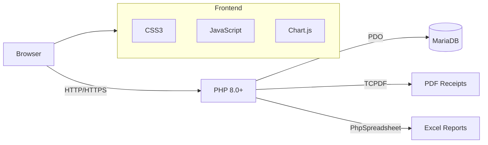
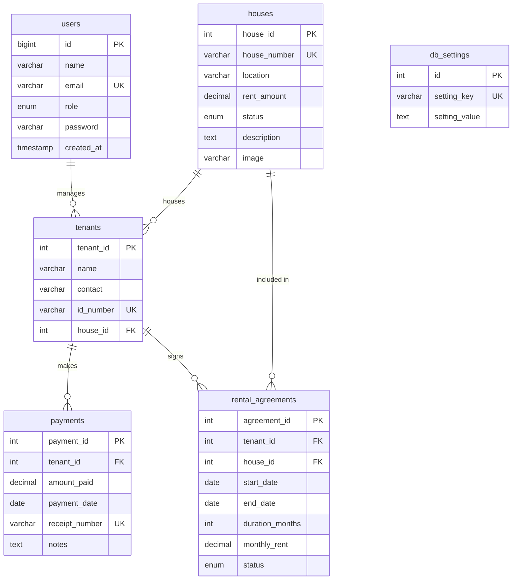

# Nyumbalink

**Rental Management System**

[](https://php.net)
[](https://mariadb.org)
[](LICENSE)

A modern web application for managing rental properties, tenants, payments, and generating professional reports. Built with PHP and MySQL, designed for property managers in Kenya.

---

## Features

- **Dashboard** — Real-time statistics with interactive charts
- **House Management** — Add, edit, view, and delete rental properties with image support
- **Tenant Management** — Register tenants, manage rental agreements, and track assignments
- **Payment Recording** — Record payments with automatic receipt generation
- **PDF Receipts** — Professional branded PDF receipts via TCPDF
- **Reports** — Payment, tenant, and occupancy reports with PDF/Excel export
- **Role-Based Access** — Admin and staff roles with granular permissions
- **Security** — CSRF protection, rate limiting, prepared statements, security headers

---

## Tech Stack

| Layer | Technology |
|-------|------------|
| Backend | PHP 8.0+ |
| Database | MariaDB / MySQL 5.7+ |
| Frontend | HTML5, CSS3, JavaScript |
| PDF Generation | TCPDF |
| Excel Export | PhpSpreadsheet |
| Charts | Chart.js |
| Icons | Bootstrap Icons |

---

## Architecture



---

## Database Schema



---

## Project Structure

```
Nyumbalink/
├── assets/              # CSS, JS, images
│   ├── css/style.css
│   ├── js/app.js
│   └── images/
├── config/              # Application configuration
│   ├── app.php
│   └── database.php
├── includes/            # Core functions and services
│   ├── core.php
│   ├── functions.php
│   ├── header.php
│   ├── footer.php
│   └── services/
├── modules/             # Feature modules
│   ├── auth/            # Login, logout, registration
│   ├── dashboard/       # Main dashboard
│   ├── houses/          # Property management
│   ├── tenants/         # Tenant management
│   ├── payments/        # Payment recording & receipts
│   └── reports/         # Report generation
├── vendor/              # Composer dependencies
├── .env                 # Environment configuration
├── .htaccess            # URL rewriting & security
├── composer.json
├── index.php            # Entry point
└── README.md
```

---

## Getting Started

### Prerequisites

- PHP 8.0 or higher
- MariaDB 10.5+ or MySQL 5.7+
- Composer

### Installation

1. **Clone the repository**

   ```bash
   git clone https://github.com/mianohh/Nyumbalink.git
   cd Nyumbalink
   ```

2. **Install dependencies**

   ```bash
   composer install
   ```

3. **Configure environment**

   ```bash
   cp .env.example .env
   ```

   Edit `.env` with your database credentials:

   ```
   DB_HOST=localhost
   DB_NAME=nyumbalink
   DB_USER=root
   DB_PASS=your_password
   ```

4. **Create the database**

   ```bash
   mysql -u root -p -e "CREATE DATABASE nyumbalink CHARACTER SET utf8mb4 COLLATE utf8mb4_unicode_ci;"
   ```

5. **Run the installer**

   Navigate to `http://localhost/Nyumbalink/install.php` in your browser, or run the SQL schema manually.

6. **Delete install.php** (security)

   ```bash
   rm install.php
   ```

7. **Start the development server**

   ```bash
   php -S localhost:8000
   ```

### Windows (XAMPP)

1. Start Apache and MySQL from XAMPP Control Panel
2. Copy the project to `C:\xampp\htdocs\Nyumbalink\`
3. Create database `nyumbalink` in phpMyAdmin
4. Visit `http://localhost/Nyumbalink/install.php`
5. Delete `install.php` after installation

---

## Default Credentials

| Role | Email | Password |
|------|-------|----------|
| Admin | `admin@nyumbalink.com` | `admin123` |

> **Important:** Change the default password immediately after first login.

---

## Security

- **CSRF Protection** — All forms include anti-CSRF tokens
- **Rate Limiting** — Login attempts are rate-limited per IP
- **Prepared Statements** — All database queries use PDO prepared statements
- **Security Headers** — X-Content-Type-Options, X-Frame-Options, X-XSS-Protection
- **Session Security** — HTTP-only cookies, session regeneration on login
- **Password Hashing** — bcrypt via `password_hash()`

---

## Premium Version

A higher version of Nyumbalink is available with additional features:

- **M-Pesa Integration** — Automated payment processing via Safaricom Daraja API
- **SMS Reminders** — Automatic rent due reminders and payment confirmations via SMS
- **Automated Receipts** — Instant M-Pesa confirmation receipts sent to tenants
- **Payment Reconciliation** — Real-time matching of M-Pesa transactions to tenant accounts

For access to the premium version, contact:

- **Email:** alexmiano101@gmail.com
- **GitHub:** [@mianohh](https://github.com/mianohh)

---

## Contributing

1. Fork the repository
2. Create a feature branch (`git checkout -b feature/amazing-feature`)
3. Commit your changes (`git commit -m 'Add amazing feature'`)
4. Push to the branch (`git push origin feature/amazing-feature`)
5. Open a Pull Request

---

## License

This project is licensed under the MIT License. See the [LICENSE](LICENSE) file for details.
